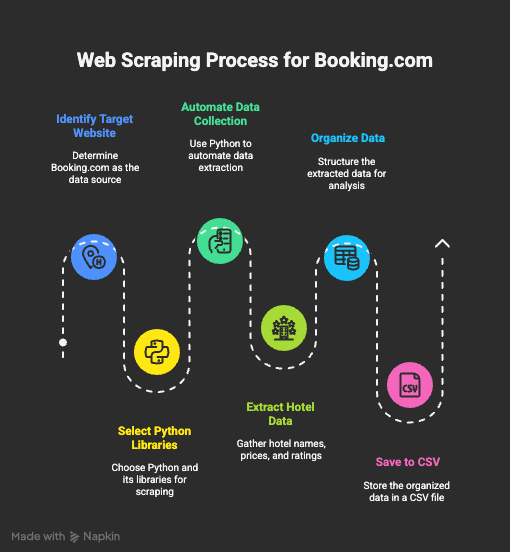

# web_scraping_for_Booking.com

<p align="center">
  
</p>


## 📌 Project Overview

This project is a web scraping application designed to extract hotel details from [Booking.com](https://www.booking.com).  
It scrapes hotel information such as name, price, location, ratings, reviews, and booking links for any given city and date range, then saves the data as a CSV file in the local directory.

---

## 🎯 Objectives

1. **Automate Hotel Data Collection** – Extract key details from Booking.com efficiently.  
2. **Flexible Scraping** – Allow users to input a URL and filename for custom searches.  
3. **Data Storage** – Save extracted hotel details in a structured CSV format.  
4. **Error Handling & Performance** – Implement sleep timers and request headers for smooth scraping.  
5. **User-Friendly Execution** – Provide a seamless command-line experience for users.  

---

## 🛠️ Technologies & Libraries Used

- **Python 3.x**  
- **BeautifulSoup4** – For parsing HTML and extracting hotel details.  
- **Requests** – For sending HTTP requests to Booking.com.  
- **CSV** – To store extracted data in a structured format.  
- **LXML** – For fast and efficient HTML parsing.  


## 📂 Features & Workflow

1. Users provide a **Booking.com** search URL and a file name.  
2. The scraper fetches the page and extracts:  
   - Hotel Name 
   - Price
   - Location 
   - Rating
   - Review Count
   - Booking Link
3. The extracted data is **saved into a CSV file** in the local directory.  
4. The program implements **random sleep intervals** to mimic human behavior and avoid blocking.  


## 🚀 How to Run the Script

1. Install required dependencies:
   ```bash
   pip install -r requirements.txt

2. Run the script:
   ```bash
   python script.py

## ⚠️ Disclaimer

This project is intended for **educational purposes only**. Scraping websites without permission may violate terms of service.  
Use responsibly and check Booking.com's scraping policies before deploying.  

